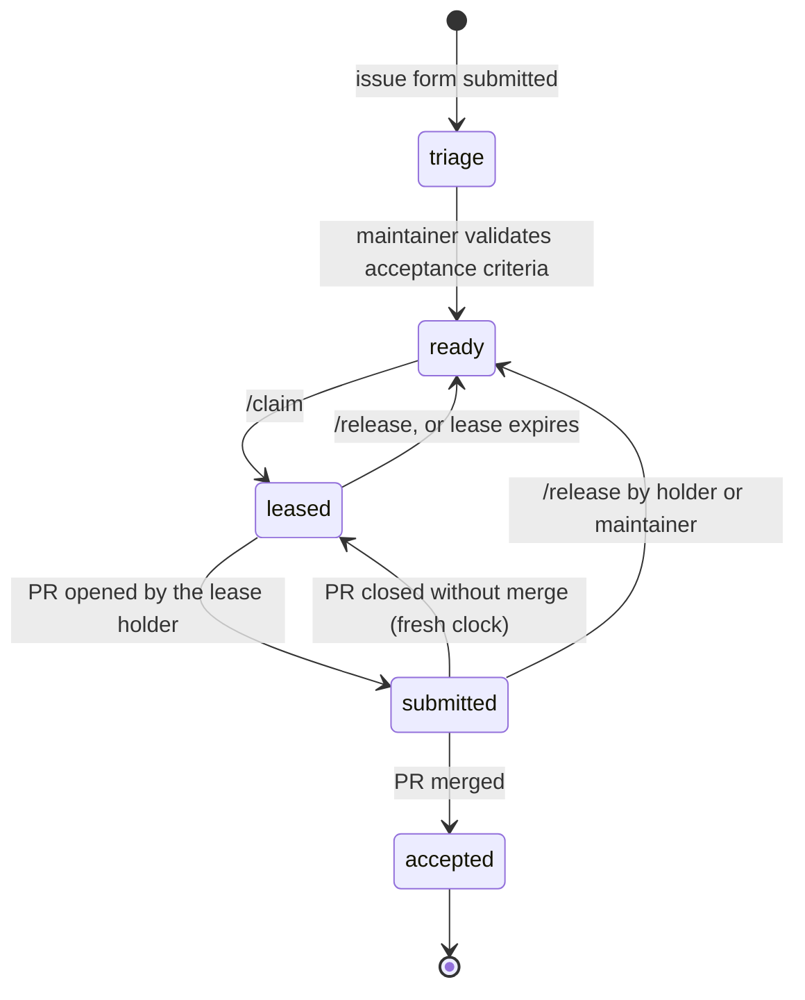

# The KOS Task Board

Kentucky Open Science runs a task board where organizations post small,
well-specified programming tasks and volunteers complete them with the AI-agent
hours they would otherwise lose at the end of their subscription week. Every
task has machine-checkable acceptance criteria, exactly one person holds it at a
time, a human reviews every line before merge, and completed work earns points
on the [public leaderboard](https://kentucky-open-science.github.io/leaderboard.html).
Open tasks are listed on the [bounty board](https://kentucky-open-science.github.io/bounties.html).

This document is the protocol. It is deliberately boring: GitHub Issues are the
board, labels are the state, GitHub Actions are the referee.

## Contents

1. [The state machine](#the-state-machine)
2. [For volunteers: claiming and completing a task](#for-volunteers)
3. [For submitters: writing a task](#for-submitters)
4. [For maintainers: triage, review, operations](#for-maintainers)
5. [Points and the leaderboard](#points-and-the-leaderboard)
6. [What the pilot measures](#what-the-pilot-measures)
7. [Security model](#security-model)

## The state machine

Each task is a GitHub issue carrying the `kos:task` label plus exactly one state
label. Bots move tasks between states; humans only need four slash commands and
one merge button.



| State | Label | Meaning |
| --- | --- | --- |
| triage | `kos:triage` | Submitted; a maintainer still has to confirm the tests and scope make sense. |
| ready | `kos:ready` | Claimable. Comment `/claim`. |
| leased | `kos:leased` | Held by the assignee until the expiry in the lease comment (default 48 h, one `/extend`). |
| submitted | `kos:submitted` | The holder's PR is open; the lease clock is paused. |
| accepted | `kos:accepted` | Merged, credited, closed. |

Two rules do most of the work:

- **One lease per person at a time.** `/claim` is refused while you hold another lease.
- **A lease is exclusive and short.** When it expires the task returns to the pool and unmerged work is discarded; the next claimant starts from the original snapshot. There is no partial credit, so there is nothing to split.

## For volunteers

### What you need

- A GitHub account and the [`gh` CLI](https://cli.github.com/) signed in (`gh auth login`).
- Node 20 or newer.
- A coding agent that runs on your machine under **your own** subscription — Claude Code, Codex CLI, Cursor, Aider, or plain hands. The board never sees your credentials and never runs your agent; it only sees the pull request.

### The loop

1. **Fork and clone** (once):
   ```bash
   gh repo fork Kentucky-Open-Science/kentucky-open-science.github.io --clone
   cd kentucky-open-science.github.io && npm ci && npx playwright install --with-deps chromium
   ```
2. **Pick a task** on the [bounty board](https://kentucky-open-science.github.io/bounties.html) (or from the [open issues](https://github.com/Kentucky-Open-Science/kentucky-open-science.github.io/issues?q=is%3Aissue+is%3Aopen+label%3Akos%3Aready)) and **claim it** by commenting `/claim` on the issue. Within a minute the bot assigns you and posts the expiry time. If it refuses, it says why. On the bounty board, clicking a task gives you a prompt that makes your coding agent do this step and the next ones for you.
3. **Do the work** on a branch named `kos/<task-number>-<slug>` from the current `main`. `npm test` is the acceptance suite; the task's `FAIL_TO_PASS` IDs must go green and you must delete exactly those IDs from `tests/known-failures.json`.
4. **Open the PR** using the template. Fill the `KOS-Task: #N` line, the provenance fields (model, harness, rough usage), and tick every attestation — including the one that says a human read the whole diff. That attestation is the product; do not sign it for your agent. (If your agent opened the PR for you, tick the boxes on the PR page on GitHub; the gate re-runs.)
5. **Respond to review.** When it merges you get the task's points; the issue closes itself.

Need more time? `/extend` once. Can't finish? `/release` promptly so someone else can.

Posting a command from a terminal? Use `echo /claim | gh issue comment <n> --body-file -`.
Git Bash on Windows rewrites `--body "/claim"` into a file path such as
`C:/Program Files/Git/claim`; the bot notices and replies with this hint, but the command does nothing.

### Letting your agent drive

The easiest way: open the [bounty board](https://kentucky-open-science.github.io/bounties.html),
click a task, press **Copy prompt**, and paste it into your agent (Claude Code,
Codex, Cursor, …) in any folder. The prompt names the task, forks and clones the
repository if needed, claims the task, states the rules, and stops for your
review before a pull request is opened. Maintainers edit its wording in
`src/claim-prompt.txt`.

The repository's `AGENTS.md` (and `CLAUDE.md`, which imports it) teaches agents
the same rules. A prompt that works with Claude Code or Codex from inside your
clone, for any open task:

> Claim the next available KOS task and complete it. Use `gh issue list --label kos:ready` to find one, comment `/claim`, wait until `gh issue view <n> --json assignees` shows me as the assignee, then follow AGENTS.md: branch, implement, `npm test`, shrink `tests/known-failures.json` by exactly the FAIL_TO_PASS IDs, and open the PR with the template filled in. Stop before opening the PR and show me the diff.

Keep the last sentence. You are the human in the loop.

## For submitters

A task is a SWE-bench instance ([Jimenez et al., ICLR 2024](https://arxiv.org/abs/2310.06770)) with a human checklist attached. The issue form asks for:

| Form field | SWE-bench field | Why it matters |
| --- | --- | --- |
| Problem statement | `problem_statement` | What an agent reads first. Say what is wrong, for whom, and what done looks like. |
| Repository snapshot | `base_commit` | Where the solver starts. Usually `main`. |
| Scope | — | Files in and out of scope, so two concurrent tasks do not collide. |
| `FAIL_TO_PASS` | `FAIL_TO_PASS` | Test IDs that fail now and must pass. The gate checks each one. |
| `PASS_TO_PASS` | `PASS_TO_PASS` | What must not regress. `*` means the rest of the suite. |
| How to run the tests | `environment_setup_commit` / install | Exact commands. |
| Human acceptance checklist | — | What a person verifies that tests cannot: wording, visual quality, "nothing unrelated changed". |
| Hints and pointers | `hints_text` | Optional. |
| Size | — | S / M / L; sets the points. |

**If you cannot name a failing test, the task is not ready.** Write the test
first (or ask a maintainer to help; that scoping work is a service KOS provides).
For websites the harness in `tests/` already generates hundreds of named checks
per page — WCAG 2.1 AA via axe-core, HTML validity, reflow at 320 px, reduced
motion, focus visibility, dead links — so most accessibility tasks can cite
existing IDs. Add a page to `tests/pages.json` and it gets the full matrix.

The suite tests the site built from frozen fixtures (`tests/fixtures/`), not
from the nightly data, so a task's tests fail and pass because of code changes
only. A task that needs different fixture data must say so in its scope.

Good tasks are small enough to finish in one lease (S or M), touch a bounded set
of files, and have acceptance criteria that would make a reviewer's decision
obvious.

## For maintainers

### Triage

A new task arrives with `kos:triage`. Check that the FAIL_TO_PASS IDs exist in
the suite and fail today (`npm test` output, or `tests/known-failures.json`),
that the scope is disjoint from other open tasks, and that the human checklist
is concrete. Apply a `kos:size-S/M/L` label, then swap `kos:triage` for
`kos:ready`. That is the whole approval.

### Review

The acceptance gate (workflow "Acceptance tests") posts a summary on each PR:
lease held, FAIL_TO_PASS green, PASS_TO_PASS green, baseline shrank by exactly
the right IDs, provenance filled. Your job is what the gate cannot do: read the
diff against the task's human checklist, and refuse anything outside scope.
Approve, then merge. The "KOS PR state" workflow marks the task accepted, awards
points (and reviewer credit to approvers), and closes the issue.

### Operations

- **Labels and seed tasks:** `GITHUB_TOKEN=<token> node .github/kos/bootstrap.js` creates the labels (idempotent) and files the tasks in `.github/kos/seed-tasks.json` that do not already exist. Use `--dry-run` first.
- **Lease sweep:** runs hourly ("KOS lease expiry"); run it by hand from the Actions tab if you disabled schedules. GitHub pauses cron in repositories with no commits for 60 days.
- **Site, bounty board, and leaderboard:** the "KOS site" workflow (`kos-site.yml`) refreshes `data/projects.json` (public repositories) and `data/board.json` (tasks and points), builds, and deploys to GitHub Pages. It runs on every push to `main`, nightly, when a person changes a task's labels, and when the bots dispatch it after `/claim`, `/release`, `/extend`, a lease expiry, or a PR transition. The nightly run commits the refreshed data; if you enable branch protection, allow the `github-actions` bot to push or drop that step. Pages must be set to deploy from GitHub Actions (Settings → Pages → Source).
- **Config:** `.github/kos/config.json` — lease hours, extensions, warning window, points, label names.
- **Fork PRs from first-time contributors** need a maintainer to click "Approve and run" once (Settings → Actions → "Fork pull request workflows"). Set it to require approval only for first-time contributors, not for everyone, or the pilot will feel slow.
- **Tests for the bots and the builder:** `npm run test:unit` runs the unit tests for the lease logic (with a fake GitHub API) and the site builder. The acceptance workflow runs them on every PR.

## Points and the leaderboard

- Points are fixed at acceptance from the size label: S = 10, M = 25, L = 60 (see config). The record is written into the task itself, so history does not change if the config does.
- Each reviewer who approved the merged PR earns 25 % of the task's points. Review time is the scarce resource; this makes it visible.
- Expired or released leases earn nothing and cost nothing.
- The [leaderboard](https://kentucky-open-science.github.io/leaderboard.html) and the [bounty board](https://kentucky-open-science.github.io/bounties.html) are regenerated automatically and live on the KOS site.

## What the pilot measures

Everything below can be computed from issue events and PR metadata; nothing
extra is collected.

| Metric | Source |
| --- | --- |
| Completion rate | tasks accepted ÷ tasks claimed |
| Lease-expiry rate | expiry comments ÷ claims |
| Reviewer minutes per PR | maintainers self-report in the PR review, or PR open → merge wall time as a proxy |
| Merged without edits | PRs merged with zero reviewer-requested changes ÷ merged PRs |
| Agent usage per task | the PR's "Approx. usage" field |

## Security model

- Volunteers' agents run on volunteers' machines under their own subscriptions. The board holds no credentials and calls no model.
- Only the lease holder's PR can pass the gate for a task, and only one person holds a lease.
- Workflows that have write permissions (`kos-board`, `kos-lease-expiry`, `kos-pr-state`, `kos-site`) never execute code from a pull request. The only workflow that runs PR code (`kos-pr-gate`) has a read-only token.
- Tasks must not require secrets or private data; the submitter attests to this and maintainers check at triage.
- Every merged change records who ran what model under which harness, and which human signed off. That record is what lets an organization accept work from strangers' agents.
